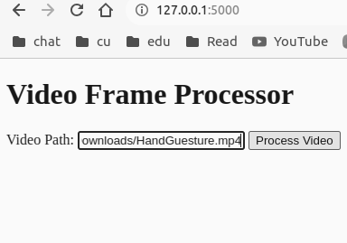

# Video to Image Dataset

## Summary

The Video Frame Processor is a Flask-based web application designed to process video files and extract individual frames. This project aims to provide an easy-to-use tool for extracting frames from videos and storing them for further analysis or use. By utilizing the power of Flask, OpenCV, and Docker, this project offers a streamlined solution for video frame extraction.

## Project Highlights

- **Efficient Video Frame Extraction:** The core functionality of the application is its ability to process video files and extract individual frames. The application takes a video file as input and creates a collection of image frames, making it a valuable tool for video analysis and content creation.

- **User-Friendly Web Interface:** The Flask app includes a user-friendly web interface where users can input the path to their video file. This interface enhances accessibility and usability, allowing users to interact with the application without requiring programming knowledge.

- **Docker Containerization:** The application is containerized using Docker, ensuring consistent behavior across different environments. This containerization simplifies deployment, making it easy to share and run the application on various systems.

- **Educational Achievement:** Throughout the development of this project, we achieved a significant milestone by successfully creating and training our own image dataset. This experience has provided valuable insights into image processing, data management, and web application development.

## How to Use

1. Provide the path to the video file in the provided input field.
2. Click the "Process Video" button to initiate the frame extraction process.
3. Frames will be stored in the designated output directory.

## Conclusion

The Video Frame Processor represents a successful integration of Flask, OpenCV, and Docker to create a powerful and user-friendly web application. The ability to extract frames from videos has diverse applications, from video editing and content creation to machine learning training datasets. By achieving the goal of creating and training with our image dataset, we have not only accomplished technical milestones but also gained valuable knowledge in various domains.
